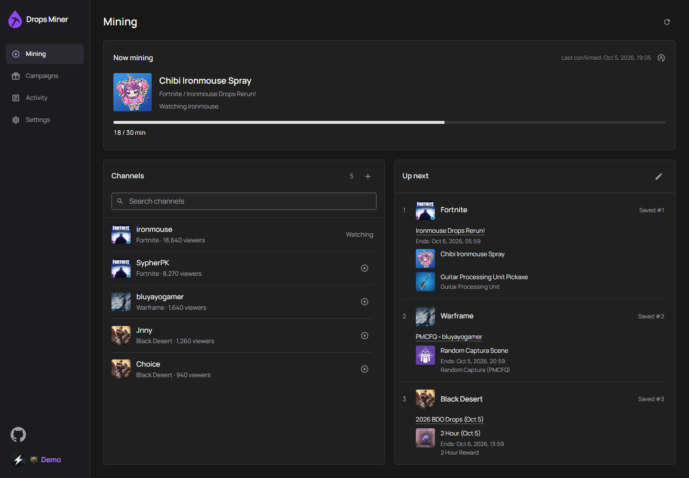

<p align="center">
  
</p>

<h1 align="center">Twitch Drops Miner</h1>

<p align="center">Mine timed Twitch Drops without streaming video or audio.</p>

<p align="center">
  <a href="https://github.com/ohne-b/twitch-drops-miner?tab=License-1-ov-file"></a>
</p>

Twitch Drops Miner runs on your own hardware and manages one Twitch account through a
web dashboard. It discovers campaigns, watches eligible live channels through Twitch
watch events, and claims earned rewards. The Rust executable includes the React dashboard.



> [!NOTE]
> This is a hobby project for personal use on your own hardware and home network.
> Support is best effort. VPS, cloud hosting, and services operated for other users are
> outside the support scope; continued compatibility with Twitch is not guaranteed.

## Features

- Automatic discovery of active and upcoming campaigns, with game priorities and channel selection.
- Reward-type filters and drop-name ignore rules that account for prerequisite rewards.
- Live progress with a distinction between Twitch-confirmed values and local estimates.
- Saved Twitch sessions, claimed-drop history, and completed campaigns.
- Claim history inside Campaigns, with shared search, game filters, sorting, and layouts.
- Optional password protection for the dashboard, API, and live connections.
- Docker images for amd64 and arm64, or a standalone executable built from source.

## Quick start

### Docker Compose

Install Docker with Compose support.

<details>
<summary>New to Docker?</summary>

| System | Guide |
| --- | --- |
| Windows | [Docker Desktop](https://docs.docker.com/desktop/setup/install/windows-install/) |
| macOS | [Docker Desktop](https://docs.docker.com/desktop/setup/install/mac-install/) |
| Linux desktop | [Docker Desktop](https://docs.docker.com/desktop/setup/install/linux/) |
| Linux server | [Docker Engine](https://docs.docker.com/engine/install/) and [Compose](https://docs.docker.com/compose/install/linux/) |

</details>

In a new folder, save this as `compose.yaml`:

```yaml
services:
  twitch-drops-miner:
    image: ghcr.io/ohne-b/twitch-drops-miner:latest
    container_name: twitch-drops-miner
    user: "1000:1000"
    ports:
      - "127.0.0.1:8080:8080"
    volumes:
      - ./data:/app/data
      - ./logs:/app/logs
    restart: unless-stopped
```

<details>
<summary>Using Docker Desktop or Docker Engine</summary>

Create the `data` and `logs` directories beside that file. On Linux, make them writable
by UID/GID `1000:1000`, which runs the container. Start Docker Desktop if you use it,
then open PowerShell (Windows) or Terminal (macOS/Linux) in that folder and run:

```bash
docker compose up -d
```

Open <http://127.0.0.1:8080> and follow [First login](#first-login).
Keep Docker running and the computer awake while mining.
The port mapping limits access to the local machine. For LAN access, bind an explicit
LAN address and enable [dashboard protection](#dashboard-password-and-remote-access).

</details>

Release images use GitHub Container Registry at `ghcr.io/ohne-b/twitch-drops-miner`.
`latest` follows stable releases; use an explicit version tag to pin a release.
Release and edge images are the production images already built and tested by main's
validation run. Publishing transfers those images without rebuilding them.
To pull from [Docker Hub](https://hub.docker.com/r/ohneb/twitch-drops-miner), use
`ohneb/twitch-drops-miner:latest` instead. The mirror preserves the same amd64/arm64
images; keep the Compose service, volumes and settings unchanged.
For reviewed fixes between releases, use `ghcr.io/ohne-b/twitch-drops-miner:edge`
in the same Compose service, then run `docker compose pull twitch-drops-miner`
and `docker compose up -d --no-deps twitch-drops-miner`. Edge is published manually
from validated main, without a version bump or GitHub release. It retains the Cargo
version; the image's `org.opencontainers.image.revision` label identifies its commit.
Switch the image back to `:latest` to return to stable releases.
The historical 0.1.0 image remains at `ghcr.io/ohne-b/twitch-miner:0.1.0` for rollback.
Renaming the GitHub repository does not rename that old package or its pull command.
[Release notes](https://github.com/ohne-b/twitch-drops-miner/releases)
and the [changelog](CHANGELOG.md) describe changes between versions. Each release's
**Changelog** link opens its commit comparison (or commit history for the first release).

<a name="build-from-a-checkout"></a>
<details>
<summary>Build the Docker image from a checkout</summary>

The repository's [docker-compose.yml](docker-compose.yml) builds the image locally and
uses the same data paths, user, and loopback port mapping. With Git and Docker installed:

```bash
git clone https://github.com/ohne-b/twitch-drops-miner.git
cd twitch-drops-miner
```

Create writable `data` and `logs` directories as above, then run:

```bash
docker compose up -d --build
```

</details>

### Run from source

Install [Rust through rustup](https://rustup.rs/), Node.js 24, and Git. Windows builds
also require the Visual Studio C++ build tools. The repository pins the Rust toolchain.

```bash
git clone https://github.com/ohne-b/twitch-drops-miner.git
cd twitch-drops-miner
npm --prefix frontend ci
npm --prefix frontend run build
cargo run --locked -- --host 127.0.0.1
```

Open <http://127.0.0.1:8080>. Data and logs go to `data/` and `logs/` relative to the
working directory. After building the frontend, create a release executable with:

```bash
cargo build --release --locked --bin twitch-drops-miner
```

The executable in `target/release/` embeds the dashboard and runs without Node.js.
Use `--help` for host, port, data directory, and log directory options.

## First login

1. Open **Settings > Twitch account** and follow the displayed device-code authorization
   link. Complete authorization on Twitch, then confirm in the dashboard.
2. Link the relevant game accounts through
   [Twitch Drops campaigns](https://www.twitch.tv/drops/campaigns).
3. In **Campaigns**, select **Mine** on a campaign. This selects its game across all
   eligible campaigns. Add more games the same way.
4. Reorder **Mining > Edit > Game priorities** and leave the miner running. It selects an
   eligible live channel and claims rewards when Twitch makes them available.

> [!IMPORTANT]
> Automatic mining watches selected games first. In **Mining > Edit**, enable **Badges** or
> **Emotes** under **Also mine from other games** to include their rewards.
> Both options default off. With an empty game list and both options off, automatic
> watching pauses. Discovery never changes your game list. An explicit **Mine channel** request
> temporarily overrides this list. **Stop mining** removes a game from the automatic
> list. Already-earned rewards can still be claimed.

Automatic reward types target individual watch rewards and their required prerequisite
drops, not every reward in a matching campaign. Other games follow selected games and
use soonest-ending campaign order. Mining benefit filters, ignored names, dates and
channel restrictions still apply; subscription-only rewards are excluded. Campaigns
display filters do not affect these rules. Removing a game from the priority list still
allows matching badges/emotes when their automatic rule is enabled.

Login uses Twitch's Smart TV device authorization flow. The saved session survives
restarts; enter your Twitch password only on Twitch's authorization page.

Campaign discovery uses the [SunkwiBOT public catalog](https://github.com/SunkwiBOT/twitch-drops-api).
It supplies game/reward metadata, dates, prerequisites and participating channels. Account
progress, linkage and claims come from Twitch through your device-code session; Twitch
credentials and identifiers are never sent to the catalog service. Discovery never selects
games automatically. The miner does not query Twitch's gated catalog/detail endpoints or
scan live channels to reconstruct the catalog.

The public feed is a third-party dependency, and its coverage can vary or lag Twitch,
including upcoming or account-specific campaigns. Refresh rejects feed timestamps older
than 30 minutes or over 5 minutes in the future. Failed, stale or malformed responses keep
known active/upcoming campaigns in memory while preserving fresh Twitch inventory. A
restart still needs the feed to rediscover campaigns outside your Twitch inventory.
Public campaigns that explicitly disable channel restrictions remain discoverable when
the feed omits their unused channel list.

Malformed Twitch inventory records are treated as a partial refresh, preserving known
campaigns instead of interpreting missing channel restrictions or prerequisites as empty.
Duplicate account campaign IDs are also excluded. Rejected account records cannot be
replaced by public catalog assumptions or used to infer a pending claim from awards;
confirmed claim receipts still recover after a restart.

Interrupted inventory and progress responses use bounded retries. Successful device-login
exchanges and acknowledged watch events are never replayed because of a response-body failure.
An interrupted token-validation rejection still attempts renewal with the saved refresh token.
Notification dismissal failures appear in Activity without postponing watch scheduling.

> [!WARNING]
> Avoid watching Twitch manually with the same account while mining. Simultaneous
> viewing can interfere with drop progress.

## Using the dashboard

Times use the 24-hour clock (`00:00–23:59`) in your browser's timezone. Dates keep your
browser's local format; Activity also shows seconds.

**Mining > Channels** shows live streams currently eligible for your selected games and
rewards, plus your manually selected channel. Special-event campaigns can include other
categories when their actual channel restriction allows it. Channel changes pause watching
until fresh stream information is available.

Use the **+** icon (**Mine channel**) to enter a Twitch login or a direct channel URL, including streams
missing from the list or campaign catalog. A live channel can be watched even when no
reward is discovered; this does not add games to your saved list. Twitch still determines
whether any rewards accrue. Manual mode shows a known reward only after Twitch reports
its progress, and never invents progress for unknown rewards.
The Mine button stays disabled while Twitch checks a channel; lookup errors appear inline.

Optionally enter **Auto mode after** in minutes (1–1440). The timer starts when the channel
is selected and continues through dashboard reconnects and connection renewal. Leave it
blank to watch until **Return to Auto Mode**. If the channel goes offline, manual mode
waits for it to return; the timer continues. Logout, cache clearing or a process restart
also ends manual mode. Automatic selection resumes using your saved games and filters.

**Refresh inventory** in Mining and Campaigns is an icon-only button. Its refresh icon
spins until the refreshed data is published, then briefly becomes a tick. An error icon
offers retry after failure. The tooltip and accessible name describe the current state;
error details or the public catalog update time are available in the tooltip and accessible
description. Screen readers also receive status changes. Repeated requests share the same
refresh; reconnecting the dashboard keeps its current status. The button stays the same size
throughout, and reduced-motion preferences disable spinning.

| Page | What it shows |
| --- | --- |
| **Mining** | Confirmed progress, live channels, Up next, and a separate **Edit** view for mining preferences. |
| **Campaigns** | Searchable campaign summaries, eligibility, detailed rewards and game-wide Mine controls. |
| **Campaigns > History** | Recorded claims grouped by campaign, including rewards no longer in the catalog. |
| **Activity** | Searchable session events, categories, warnings, repeated failures and recovery. |
| **Settings** | Twitch account, dashboard access, connection and maintenance. |

**Up next > Edit** opens Mining preferences in place of the overview. The back arrow returns
to Mining; edits continue to autosave. On desktop, the game list scrolls independently while
search, priority controls and the settings beside it stay in place. Short windows give the
settings column its own scrolling when needed; if an error or reconnect notice leaves too
little space, the games column can scroll too, keeping its controls reachable and the page fixed.
Game search results appear directly below the search controls, above the selected games.
Mining preferences keeps explanations behind info icons. Click or tap one for the selected
priority mode's rules, other-game reward rules or ignore/dependency details; Enter or Space
also opens help, and Escape or clicking outside closes it. Help stays available while
reconnecting. **Allowed reward types** filters mining across selected and other games.
Settings tabs switch in place, preserving drafts and browser back/forward navigation.
They share the same content starting position, without repeated section headings
or trailing separator lines. The Twitch account tab keeps its status and logout control;
the sidebar footer has no divider above GitHub.

Open a campaign or reward to inspect its dates, prerequisites, account linkage and confirmed
progress. On wide screens, tabs, search and filters stay full width above the list and details.
Both panes fill the remaining height, even for a single reward. The campaign list has a small
gap before its scrollbar. The list and detail body scroll independently, with the detail heading
always visible. In short windows, the controls area can scroll to keep filters reachable.
Opening desktop details keeps the selected campaign in view as the list narrows, including
after changing between grid and list layouts.
Details fill the page on smaller screens, with background scrolling locked until they close.
Only the detail content scrolls; closing restores the list position.
Details opened from Mining or Activity return to that page and its link on Close or Back.
Channel search and Activity search/category/severity stay in the URL so the filtered view
survives that round trip; after resizing, the original link is brought back into view.
Campaign dates appear once above the rewards;
individual rewards show dates only when their effective window differs from the campaign.
Available details show each claimed reward once, with its recorded claim time beside the
status, or a first-observed label when the claim time is unknown. Additional benefit names
remain visible without repeating the reward name. Reward artwork fits inside its thumbnail.
Campaign rows use a small side-panel icon hover without a selection stripe;
the Mine icon keeps its own circular hover.
Close or press Escape to return to the same list position and filters. Campaign and drop links
can be bookmarked; old or unavailable IDs show an explicit missing-record state.

Search, filters, sorting, layout and pagination stay in the Campaigns URL. Opening a shared
link does not change saved preferences. Available and History each show 25 campaign groups
per page. Unknown progress remains unknown until Twitch supplies evidence.
History loads without a loading caption; request errors still offer Retry.

Activity keeps the latest 1,000 events for the current process. Filter by category or severity,
search messages, or use the down arrow to follow new events. Repeated adjacent failures share
one row with a count; category labels stay in the filter rather than beneath each event.
Row separators are inset from the edges of the Activity panel. Adjacent repeated events also
avoid duplicate lines in the server log.
Recovery requires a matching successful operation. Campaign-related
events link to their reward details. Server diagnostics remain in the log files.
The event list fits the remaining screen height and scrolls independently. An empty log
and a search or filter with no matches have separate messages.

The dashboard disables commands while reconnecting and resumes them after receiving a
complete snapshot. Unsaved edits remain separate from live updates. If a dashboard update
requires reload, the reload button keeps a temporary draft in this browser tab for up to ten
minutes; review restored edits and use Retry to save them.

### Games, filters, and ignored rewards

Campaigns opens with **Available** and **History** icon tabs styled like Settings,
with the filtered count and refresh control in the same header. Open **Filters** for
**All games** and **Clear filters**. The sort control offers **Default** (active campaigns
with confirmed progress first), **Newest** (latest campaign start), **Ending Soonest**,
**Most Drops** (total drops), and **A-Z** (campaign name). Sorting stays in the page URL
through searches, tab changes and reloads; it does not change mining priorities.
Icon-only actions have circular hover backgrounds. Search-clear actions stay inset
inside the field, and game-priority drag grips remain visible as plain six-dot handles.
On phones, refresh stays beside the tabs, search gets its own full-width row, and the count
sits beside the filter/sort/view controls. Checkboxes, search results and drag handles keep
44px touch targets. Channels, Up next and game priorities use inset separators and a smaller
scrollbar gap than Campaigns. Up next shows identical reward windows once per campaign.
Channel thumbnails use the current game's catalog artwork when stream metadata omits it;
missing or broken artwork still has a safe placeholder. This adds no Twitch requests.
Available and History use matching cards and list rows, with consistent artwork, spacing
and inset list dividers. Grid cards align to the same height within each row, with names
allowed to wrap. History keeps recorded claim counts and dates; Available shows campaign
progress, timing and mining actions. In narrow cards and rows, counts and actions sit below
the campaign name, game and date, based on the card's width rather than the screen size.

In **Game priorities**, drag games into order or focus a drag handle and use the arrow
keys. The Priority High icon beside **Add Game** opens **Mining priority**:

- **Default (manual order)** follows your saved game order, with the first game highest.
- **Short events first** prioritizes active rewards with a total earning window of at
  most 24 hours, earliest deadline first, then returns to your saved order.
- **Ending soonest** prioritizes active rewards with the nearest deadlines, including
  longer campaigns approaching their end.

Automatic modes preserve your saved drag order and use it to break ties. Dragging still
edits that base order; **Up next** reflects the effective priority while retaining its
game/campaign groups. Reward windows use the overlap of campaign and individual drop
dates. A required prerequisite can inherit its target's deadline (or its own earlier
deadline), but an unavailable or ignored event cannot boost unrelated rewards. These are
priority rules, not predictions that enough watch time remains to finish a reward.
They depend on catalog coverage and dates, and Twitch determines which reward earns progress.

Selected games remain ahead of optional rewards from other games, and manual channels
keep their override and timer. An unavailable event stream does not stop other mining.
Confirmed watch completion releases the event's priority while claims continue to reconcile;
estimates never confirm completion or unlock prerequisites. **Mining priority** is a saved
mining preference, separate from the display sort in **Campaigns**. Existing installations
default to manual order. Settings save silently; if a save
fails or another browser changes the same settings, your edits stay available for **Retry**.

Campaign status filters combine **Active**, **Upcoming**, and **Expired**; **Not linked**
narrows the result to campaigns known to need account linking. Active campaigns with
existing progress appear first. Completed campaigns leave Available only when all watch rewards
are claimed; expiry alone does not count as completion. History lists recorded claims even
when their campaigns still have unclaimed rewards.

The **Now mining** card uses Twitch-reported progress. If newer account inventory disagrees
with the live counter for the same reward, the card uses inventory's minutes and confirmation
time. The miner keeps watching and rechecks inventory at most once per minute until the
counts agree or Twitch confirms the claim. A disputed live counter reaching 100% does not
stop watching.

Confirmed watch completion releases automatic watching of that reward and prompts inventory
reconciliation. Missing claim evidence uses the same once-per-minute check, without pausing
watch events. Estimates never prove a claim. Twitch must confirm it before it unlocks
prerequisites, completes a campaign or enters **History**. Reported successor progress can
appear while that claim evidence is still pending.

Twitch can report no current drop as a null session or an empty session object.
Both continue normal watching and progress checks without confirming progress or claims.

**Ignore rewards by name** accepts one literal substring per line, matched without regard
to case. Blank lines and duplicates are removed. A matching reward and dependent branches
are ignored, while prerequisites shared with an allowed reward remain mineable. Ignored
or skipped rewards are never treated as claimed. Twitch may still advance an ignored
reward alongside another reward.

Zero-minute subscription rewards are omitted from **Campaigns** and **Up next** because
watching cannot earn them. Expired rewards leave **Up next**; upcoming and sequential
watch rewards remain visible.

**Special Events** and **IRL** can use listed participating channels in other categories
when the campaign has an enabled, nonempty channel list. Select the campaign's game and
keep its rewards eligible. Other campaigns require a matching category and drops-enabled
channel; every watched channel must be live.

Icon-only controls share circular hover backgrounds, tooltips and accessible labels. Channel
rows and manual-channel submission use a play-circle to watch; refresh-auto returns to automatic
selection. The down arrow in Activity resumes following the latest messages, and reload icons retry
errors. In Settings, Twitch
account status and ID are shown separately, with Twitch logout beside the account status;
Dashboard connected lives under Connection. Maintenance uses the MDI Update icon to check for
updates, animating while checking (except with reduced motion) and keeping the result text below.
The authorization row includes a copy-code action, Twitch Activate, and Done. Successful copying
shows a tick for three seconds and updates the tooltip and screen-reader feedback without moving
the surrounding layout. Copying again successfully restarts the confirmation. Clipboard access
requires HTTPS or localhost; if unavailable, the code can still be selected and copied manually.

### History and saved data

**History** includes the miner's claims and imports Twitch-confirmed rewards during
inventory refresh, including badges/emotes and claims made elsewhere. Imports require
matching campaign/drop metadata; rewards no longer available from either inventory or
the catalog cannot be reconstructed. Public catalog entries alone never prove a claim.
Twitch award times are used when available; otherwise **First observed** labels the time
when the miner first recorded the confirmed claim, in your browser's timezone.
History details show the recorded rewards, benefits, artwork and claim or first-observed
timestamps. Live account linking, mining eligibility and unfinished rewards stay in Available.
If a historical link has no matching claim, the panel says so; failed history requests offer Retry.

Open **Campaigns > History** to search campaign, game, reward or benefit names, filter by game,
and switch between list and grid layouts. The shared icon-only sort menu offers the same
choices as Available. History defaults to the most recently recorded claim, **Most Drops**
counts recorded claims, and date sorts use campaign dates when available (older entries
without dates come last). Claims are grouped by campaign, with 25 campaigns per page.
Use the left/right chevrons beside the page count just below the results to navigate;
unavailable directions are disabled. The desktop workspace leaves a compact margin below them.
The former `/history` link redirects here. History has no export or separate clear action.

Docker stores application data in `/app/data` and logs in `/app/logs`, mounted to the
directories in the Compose example. Settings, Twitch credentials, dashboard sessions,
claim history, and interrupted-claim recovery records live in the data directory.
Run only one miner per data directory and keep it private.

**Settings > Maintenance > Clear All Cache** discards derived campaign/channel state
and local claim history, then refreshes Twitch inventory and the public catalog. It preserves
settings, credentials, and completed campaign records. Cleared reward IDs stay recorded so
inventory imports and interrupted claims cannot restore deleted history. This cannot be undone.

## Dashboard password and remote access

Password protection is off by default. In **Settings > Dashboard access**, enter and
confirm a password, then enable protection. It protects the dashboard, application API,
and live connections. Mining continues while the dashboard is locked.

- The dashboard password is separate from your Twitch login; no username is needed.
- Sessions last up to 30 days. **Remember me** also persists the browser cookie for that period.
- Changing the password signs out other sessions. Disabling protection requires the
  current password and clears all dashboard sessions.
- Logging out of the dashboard does not log the miner out of Twitch.

> [!IMPORTANT]
> Enable protection on a trusted network before making the dashboard remotely reachable.
> Use HTTPS through a reverse proxy to protect passwords and cookies in transit.

Set `PUBLIC_BASE_URL` to the exact root URL opened in the browser. Add this under the
Compose service, replacing the example hostname:

```yaml
environment:
  PUBLIC_BASE_URL: https://drops.example.com
```

Recreate the container with `docker compose up -d` after changing its environment.
The setting controls the permitted browser origin and enables Secure cookies for HTTPS.
It does not provide TLS, support subpaths, or trust forwarded client-IP headers. Use
one HTTP(S) root URL without credentials, a query, or a fragment. A reverse proxy must
forward both HTTP and Socket.IO connections.

If you forget the dashboard password, stop the miner and restrict network access. Back up
and remove only `data/web_auth.json`, restart, then set a new password. Keep all other data.

## Updating

The repository and executable are now `twitch-drops-miner`; the dashboard is **Drops Miner**.
Existing data, login, settings and history need no migration for this rename. Keep the existing Compose service
and container name (`twitch-drops-miner`), mounts and project directory when upgrading.
The executable is now `twitch-drops-miner`; update custom service commands if you run it directly.
Existing source checkouts can update their remote with:

```bash
git remote set-url origin https://github.com/ohne-b/twitch-drops-miner.git
```

**Settings > Maintenance** checks the latest stable release and links to its notes.
Installation is manual. A failed update check is reported separately from an up-to-date
installation.

> [!CAUTION]
> Save a copy of the current Compose file before editing it or pulling source changes.
> Stop the miner before backing up its entire data directory. Keep the previous image
> and configuration for rollback.

For the published-image Compose example, update `image:` first if it pins a version tag.
Pull the image before stopping the current container:

```bash
docker compose pull
docker compose stop
```

Back up `data/`, then start the replacement:

```bash
docker compose up -d
```

For a checkout using the repository's Compose file, back up `docker-compose.yml` before
pulling changes. Build while the old container runs:

```bash
git pull --ff-only
docker compose build
docker compose stop
```

Back up `data/`, then recreate the container:

```bash
docker compose up -d --force-recreate
```

Preserve mounts, ownership, and the port binding. Restarting a container alone does not
install a new image. After replacement, inspect `docker compose ps` and
`docker compose logs --tail=100`, then check the dashboard.

When migrating from the Python version, existing settings, history, completed campaigns,
and dashboard protection remain compatible. One fresh Twitch device-code login is
required; old credential files stay untouched for rollback. Earlier development builds
labeled `1.3.2` need one manual upgrade to join the release series starting at `0.1.0`.

## Troubleshooting

### Common problems

| Problem | What to check |
| --- | --- |
| Requests time out | Try a higher **Connection Quality**; see [Connection timeouts](#connection-timeouts). |
| No campaigns appear | Clear campaign filters, then use **Refresh inventory**. For a failed or partial catalog refresh, wait and retry; relogging or clearing cache cannot repair the feed or add missing entries. |
| Mining is idle | Select a game or enable automatic badges/emotes. Check live channels, account linking, campaign dates, prerequisites, allowed reward types and ignored names. |
| Progress is stuck | Compare confirmed progress with Twitch's inventory and stop simultaneous manual viewing. Local estimates and **Dashboard connected** do not prove Twitch is awarding progress. |
| HTTP 401/403 errors | Public-page failures keep your saved login. Reauthorize when Twitch reports an authentication failure. |
| The container cannot write data or logs | Check directory permissions for UID/GID `1000:1000`. Run only one miner per data directory. |
| Writes or live updates fail behind a proxy | Open the exact `PUBLIC_BASE_URL`, check Socket.IO support and review [dashboard protection](#dashboard-password-and-remote-access). |

### Connection timeouts

**Connection Quality** defaults to **3**: **15 seconds to connect** and **30 seconds per
request**. Existing saved choices are kept.

If requests time out at **1 or 2**, try **3** in **Settings > Connection**. Keep it if
mining is stable.

- The watch interval stays **59 seconds**. Higher settings allow more time for requests,
  but also take longer to report a timeout.
- Changing the setting also reconnects Twitch. An improvement may come from the longer
  timeout or the reconnect; it does not tell us which helped.

Transient watch failures already get up to five attempts. Three consecutive failed watch
operations trigger a reconnect, preserving settings and any manual channel timer.

### Logs

Read recent server errors:

```bash
docker compose logs --since=30m --tail=200 twitch-drops-miner
```

The same errors go to `logs/TDM.*.log`; detailed server diagnostics stay out of **Activity**.
Normal logs include operations, HTTP status, retry attempts, parsing errors and catalog
failures. File logs retain up to five daily files; Docker retention follows your Compose settings.

### Advanced diagnostics

Use this when normal logs do not explain a failure. It adds request timings, response
metadata, nested network errors and bounded, redacted JSON previews. It is **off by
default**, even with `-v` or `-vv`.

For Docker, add this to the miner's **existing** `environment` section:

```yaml
  TDM_DIAGNOSTICS: "true"
```

Keep the other environment entries, mounts and ports, then recreate only the miner:

```bash
docker compose up -d --no-deps twitch-drops-miner
```

For a standalone binary, use `--diagnostics` or `TDM_DIAGNOSTICS=true`.
Startup logs confirm when it is enabled.

- Reproduce the problem while diagnostics are on; earlier failures cannot be recovered.
- Previews are limited to 16 KiB and may omit content. Non-JSON bodies and WebSocket
  frames are not captured.
- Logs can still contain account/campaign metadata. Review them before sharing; never
  upload credentials or your data directory.
- When done, remove the option or set `TDM_DIAGNOSTICS` to `"false"`, then recreate the
  container or restart the standalone process.

## Contributing

Read [CONTRIBUTING.md](CONTRIBUTING.md) for issue reporting, development, required tests,
and independent review. [AGENTS.md](AGENTS.md) contains the repository's agent instructions.
Backend tests use temporary storage and mock transports; browser tests start their own
offline fixture. Never use a live miner or real credentials for automated checks.
CI reuses compiled Rust dependencies while running the full code and image checks for
code changes and every main revision. PRs limited to the three repository guides use
the lighter documentation checks described in [CONTRIBUTING.md](CONTRIBUTING.md#required-validation).
Browser checks run in two isolated groups using the same fixture build.

Report reproducible problems through [GitHub issues](https://github.com/ohne-b/twitch-drops-miner/issues).
Include the version, installation method, and redacted evidence; never upload credentials,
device codes, or a data directory.

## License and credits

[PolyForm Strict 1.0.0](https://github.com/ohne-b/twitch-drops-miner?tab=License-1-ov-file), copyright 2026 ohne-b (OhneB).
This is source-available software for noncommercial use. The license does not grant
permission to modify or redistribute the software; those uses need separate permission.
Previously published copies retain their original license terms. Third-party components
retain their own licenses.

Based on [rangermix/TwitchDropsMiner](https://github.com/rangermix/TwitchDropsMiner),
which builds on [DevilXD/TwitchDropsMiner](https://github.com/DevilXD/TwitchDropsMiner),
and their contributors. The full upstream MIT license is preserved in [NOTICE.md](NOTICE.md).
Bundled font and icon notices are in
[frontend/public/assets/licenses](frontend/public/assets/licenses).
